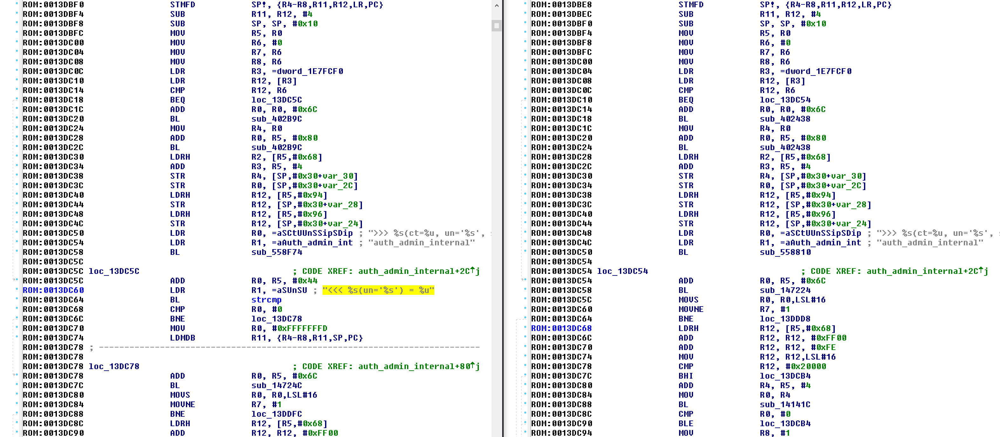

% An Introduction to IT Security
% Nicolas Prigent
% January the 11th 2016

## Security and attacks in the news

- Everyday, attacks against information systems are in the news

- Many types of attackers

- Many types of objectives

- Many types of victims

## Objectives of the attackers

- Money

- Politics

- Religion

- Business

- Military 

- Personal

## Skills and resources of the attackers

- Low-level amateurs with very limited resources

- Skilled attackers with average resources 

- Nations with skilled attackers and almost unlimited resources

## Impacts on the victims 

- Money 

- Reputation and trust

- Legal

- Organizational 

## Recent example: Cryptolocker

## Recent example: Celebgate

## Recent example: OpFrance

## Recent example: ProtonMail

 

## Recent example: Juniper backdoor

 

## What do we mean by ``security'' ? 

- _Security_ consists in enforcing that only _authorized entities_ can perform _certain tasks_ 

- The _perimeter_ of an information system is made of a set of devices, pieces of software and data and users. 

- Every information system is placed under an _authority_ that decides what is authorized and what is not. 

## Describing what is authorized 

- The _Security Policy_ defines formally or informally what is authorized, and what is not. 

- It can be based on a _white list_ (everything that is not explicitly authorized in the list if forbidden) or on a _black list_ (everything that is not in the list is authorized). 

- Enforcing the security of an information system consists in ensuring that the security policy is complete enough and that it is enforced. 

- _Security Measures_, being technical or not, are deployed and maintained to enforce the security policy.  

## Security properties : C.I.A. 

Security policy is generally expressed in terms of three security properties : 

- _Confidentiality_, that means that no unauthorized entity can access a given piece of information or service. 

- _Integrity_, that ensures that no unauthorized entity can modify a given piece of information or service. 

- _Availability_, that ensures that no unauthorized entity can prevent a legitimate one from accessing a given piece of information or service. 

They are known as the C.I.A. properties. 

## Proof

- Another security property, _Proof_, it sometimes associated to C.I.A.

- It consists in ensuring that all the actions are traced and that traces have not been tampered with. 

- It also consists in making entities accountable, _as long as they have been authenticated_. 

## Authentication 

- Authentication consists in ensuring that an entity is who he, she or it pretends to be. 

- In the real world, your ID your driver's license plays that role. 

- In the digital world, you can prove your identity by using something you know (a password), something you have (a credit card), something you are (your fingerprints for instance). 

- It is not, _per se_, a security property, but a _security service_. 

- One of the objectives of attackers is often to circumvent the authentication process. 

## Access control

- Access control consists in limiting the accesses of entities to services and pieces of data to authorized entities. 

- It therefore enforces the security policy, especially in terms of confidentiality and integrity. 

- It relies heavily on authentication 

- It can be coarse or fine-grained. 

## Vulnerability, threat agents, attack

- A _vulnerability_ is a weakness in a part of the system that allows an attacker to circumvent the security policy. It can for instance be the fact that a file sharing server does not perform any access control while containing confidential information. 

- A _threat agent_  is an entity which actions could breach security and thus cause possible harm. A threat agent can be, for instance, a criminal, an earthquake or a squirrel. 

- An _attack_ is a detrimental event during which a vulnerability is exploited 
(willingly or not) by a threat agent.

- Since it is very difficult to limit the threat agents, the purpose of security is to reduce vulnerabilities. 

- It is commonly admitted that is is not possible to make a system free of vulnerabilities. 

## Security mechanisms

Security mechanisms help enforce the security policy by reducing vulnerabilities so as to ensure security properties. 

They can act on various parts of the system : 

- On the network, 

- On the devices, 

- On the services, 

- On the data, 

- On the user. 

_In-depth security_ consists in combining multiple security mechanisms in such a way that an attacker that succeeds in circumventing one of them will not reach his or her goals. Therefore, there is no _single point of failure_. 

## Network security

Network security consists in : 

- controlling the access to the networks, 

- protecting the communications, 

- filtering communications that enter and go out the network. 

Many tools and mechanisms are available to that end.

## Protecting WiFi networks

- WiFi access points allow devices to connect wirelessly to an network and possibly to the Internet. 

- When no security mechanisms is implemented, anyone can connect to the network and anyone can eavesdrop communications. 

- WEP was first propose to prevent these. It used cryptography to enforce access control to the network and confidentiality of communications.

- Because WEP had its own vulnerabilities (due to bad use of cryptography), it was replaced by WPA. 

## Using VPN to secure communications between distant sub-networks 

## Secure everything ? 

## Security is a trade-off

- Security costs money and time. 

- It is always possible to make something more secure, and there is no perfect security. 

- The right level of security to deploy corresponds to what will make it not worth it for the attacker to target you (and then, some :-) ).

- Security measures must focus on the relevant _risks_. 

## Security is a chain

## What do you fear ? 
